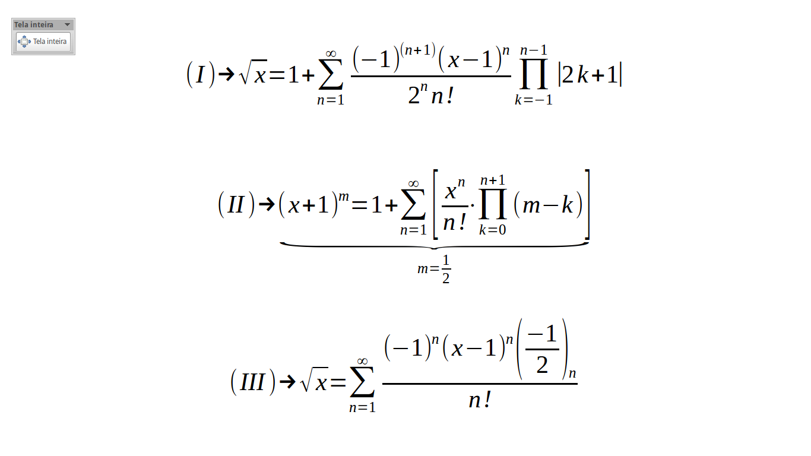

# sqrt-aprox

The coding focus is a implementation in C of heuristic solution using p-series to evaluate f(x) = sqrt(x). All this is for a college engineer project.

## Some series to inspiring the code (series to do that aproximation)

In order:
  * _(I)_ My own serie whose i found with my hands before an odd notice... (was not necessary)
  * _(II)_ The serie than Prof. Sávio give us and Gabriel it's not a her fan
  * _(III)_ The second serie aproximation we see in [Wolfram](http://www.wolframalpha.com/input/?i=sqrt%28x%29)

==
## Contributing

1. Fork it!
2. Create your feature branch: `git checkout -b my-new-feature`
3. Commit your changes: `git commit -am 'Add some feature'`
4. Push to the branch: `git push origin my-new-feature`
5. Submit a pull request :D

==

## History

We have a problem with the diverge output results of input values *n > 2*. It's frustating. For it, the focus of the problem will be to restrict the input a fix value (z = 50) and after that transform it in: z -> *k(1 + x)^(1/2)*. In other words, we need factoring sqrt(50) -> 5*sqrt(2)! Some things were made in Python for prototype the solution, but the implementation mission is in C ANSI!

## Credits

Contributors:
  * Me (Manoel Vilela)
  * Gabriel Giordano
  * Janderson Souza
  * Núria Rocha
  * Other Peoples in Soon

## License

GPL License

## Roadmap:
  - [X] Struct of algorithm and basic ideas to implement
  - [X] Construct the function in C to return the form square root factored 
  - [X] Implementation of a serie convenient (i did implement three!)
  - [X] Test series of your convergence in an input (the prototype of tests was made)
  - [X] Do the tests that our **beloved** professor wants (error estimative)
  - [ ] Fix the divergence of the series in implementation (some thing is wrong! It's not possible...)